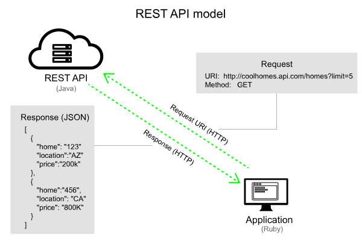

# Introduction to REST APIs
This document contains notes based on the topic [Introduction to REST APIs](https://idratherbewriting.com/learnapidoc/docapis_intro_to_rest_api_doc.html)

## What is an API
- An **API** (or **Application Programming Interface**) provides an interface between two systems.
- APIs are often _pulling_ and _pushing_ data underneath user interfaces.

### Web services
All APIs that use **HTTP** protocol as the transport format for requests and responses are considered web services. 
- Web service is web-based application that provides resources in a format consumable by other computers.
- Web services include various types of APIs, including both **REST** and **SOAP** APIs.
- Web service is basically _request-and-response_ interactions between **clients** and **servers** (a computer requests a resource, and the web service responds to the request).
- Web services are language-agnostic.

## SOAP (Simple Object Access Protocol) APIs
- SOAP APIs are _Predecessor_ to REST APIs.
- SOAP is a standardized protocol that requires **XML as the message format** for requests and responses.
- SOAP message format is defined through **WSDL** (Web Services Description Language) file.
- SOAP messages are enclosed in an **envelope** that includes a **header** and **body**, using a _specific XML schema_ and _namespace_.
The _main problem_ with SOAP is that the XML message format is too **verbose** and **heavy**.

## REST (Representational State Transfer)

- REST is a **style**, not a **standard**.
- REST APIs can use any message format, including **XML**, **JSON** (default), **Atom**, **RSS**, **CSV**, **HTML**, and more.
- REST focuses on **resources** (different types of information), not on **action**.
- The URLs are accompanied by a method (CURD).
- Common methods include **GET** (read), **POST** (create), **PUT** (update), and **DELETE** (remove).

### A sample endpoint

`http://apiserver.com/homes?limit=5&format=json`

- The **base path** (or **base URL** or **host**) refers to the common path for the API. In the example above, the base path is `http://apiserver.com`.
- The **endpoint** refers to the end path of the endpoint. In the example above, `/homes`.
- The `?limit=5&format=json` part of the endpoint contains **query string parameters** for the endpoint.

  
